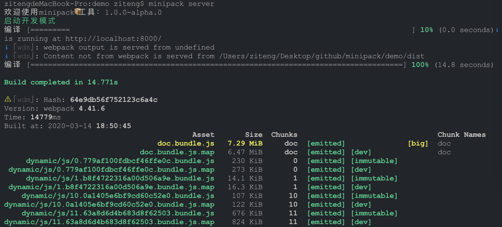

# minipack

minipack 是一个前端打包工具和文档生成工具，是《人人都可以封装 webpack》文章的实现版本。

## 特别说明

文档样式参考 antd 文档样式，样例中的 markdown 文件拷贝自 antd 的官方文档。

minipack 打包效果


minipack 解析 markdown 生成的文档效果图：


## 使用方法

全局安装

```bash
npm install -g @asathinker/minipack
```

常用命令

```bash
##编译模式
minipack build --mode dev ##编译开发版本
minipack build --mode prod ##编译正式版本
##开发模式
minipack server --mode dev ##开发模式
minipack server --mode prod ##正式代码预览
##文档模式
minipack doc --mode dev ##文档开发
minipack doc --mode prod ##正式文档预览
```

运行 demo

```bash
cd demo
yarn install
minipack server
```

源码编译 minipack，运行 demo

```bash
##安装依赖
yarn install
##编译minipack工具
yarn compile
##进入demo目录
cd demo
##安装demo依赖
yarn install
##打包模式
node ../bin/minipack.js build [--mode dev or prod]
##开发运行模式
node ../bin/minipack.js server [--mode dev or prod]
##文档模式
node ../bin/minipack.js doc [--mode dev or prod]
```

## .minipackrc.js 配置文件说明

```js
module.exports = {
  // 入口文件配置
  entry: 'src/pages/**/*js',
  // 输出设置
  output: { path: 'dist', publicPath: '/' },
  //devServer设置，具体参考https://www.webpackjs.com/configuration/dev-server/
  devServer: { port: 8000 },
  //doc配置
  doc: {
    // doc的入口
    entry: 'src/pages/doc.js',
    // docs所在的目录
    dir: 'src/components',
    // doc-loader的配置
    loaderOptions: { async: true }
  },
  // 额外的babel plugins设置
  extraBabelPlugins: [['import', { libraryName: 'antd', style: true }]],
  // 额外的babel presets设置
  extraBabelPresets: [],
  // webpack plugins设置
  extraPlugins: [],
  // 别名设置
  resolveAlias: {
    '@components': path.resolve(__dirname, 'src/components')
  },
  // less变量替换设置
  lessModifyVars: {},
  // webpack loaders
  extraLoaders: []
};
```

## .minipackrc.mock.js 数据 mock 文件说明

```js
module.exports = {
    "Mehod:Url":Object|Function,
    ...
}
```

Method: 网络请求方法：get、post、put、delete、patch、head、option……

Url: 网络请求地址

Object: 返回的 json 对象，Object 只适合返回类型是 json 的格式，如果返回类型是其他格式，请使用 Function

Function: 函数类型:(req, res) => void, req 是网络请求的 request，res 是网络请求的 response，具体可以参考[express](https://www.expressjs.com.cn/ 'express')查看详细说明
